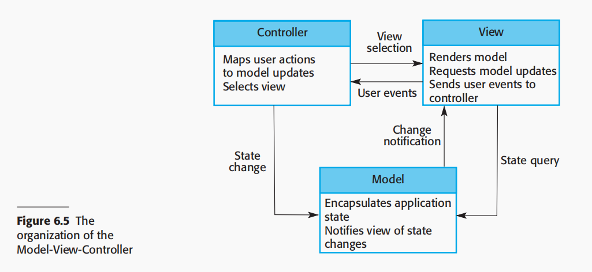

# Bài tập lớn Lập trình web HK242

## Giới thiệu mô hình MVC

| Name          | Model-View-Controller                                                                                                                                                                                                                                                                                                                                                                                                                                                                                                    |
|---------------|--------------------------------------------------------------------------------------------------------------------------------------------------------------------------------------------------------------------------------------------------------------------------------------------------------------------------------------------------------------------------------------------------------------------------------------------------------------------------------------------------------------------------|
| Description   | Tách riêng phần thể hiện (presentation) và tương tác (interaction) khỏi hệ thống dữ liệu. Hệ thống được chia thành ba thành phần logic tương tác lẫn nhau.  <ul> <li> Model component: quản lý dữ liệu hệ thống và các thao tác liên quan trên tập dữ liệu đặc thù. </li> <li>View component: định nghĩa và quản lý cách dữ liệu được trình bày phía người dùng. </li> <li>Controller component: quản lý tương tác người dùng (key presses, mouse clicks, etc.) và chuyển các tương tác đó đến View và Model.</li> </ul> |
| Organization  |                                                                                                                                                                                                                                                                                                                                                                                                                                                                                                  |
| When used     | Được sử dụng khi có nhiều cách để xem và tương tác với dữ liệu. Khuyến khích khi các yêu cầu sắp tới về tương tác và thể hiện của dữ liệu không rõ ràng.                                                                                                                                                                                                                                                                                                                                                                 |
| Advantages    | Cho phép dữ liệu thay đổi độc lập với cách thể hiện (presentation) và ngược lại cũng đúng. Hỗ trợ trình bày cùng một dữ liệu theo nhiều cách khác nhau, với những thay đổi được thực hiện trong một thể hiện được hiển thị trong tất cả chúng.                                                                                                                                                                                                                                                                           |
| Disadvantages | Có thể dẫn đến việc phải viết thêm mã và tăng độ phức tạp của mã khi mô hình dữ liệu và các tương tác còn đơn giản.

## Set up

- Tạo thư mục `db/password.txt` để lưu mật khẩu của database.
- `composer install` để cài đặt các package cần thiết. Sử dụng `composer require <name_package>` để thêm package mới.
- Chạy chương trình (theo dõi các thay đổi file) với lệnh `docker composer watch`.
- Dừng và loại bỏ các container `docker composer down`.

## Tài liệu tham khảo

- A simple PHP web application example for [Docker's PHP Language Guide](https://docs.docker.com/language/php/).
- [https://topdev.vn/blog/mo-hinh-mvc-trong-php/](https://topdev.vn/blog/mo-hinh-mvc-trong-php/)
- Playlist hướng dẫn: [Hoàng An Unicode](https://www.youtube.com/watch?v=5lyugYFJXzk&list=PL8y3hWbcppt0nl_IU1-PbRxKm69dn_Nix)
