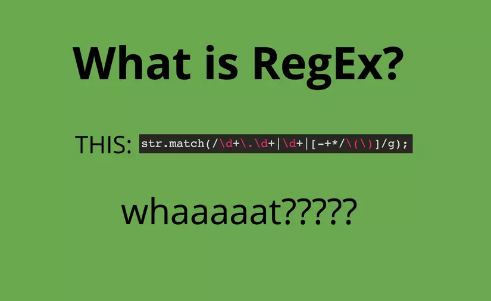

# Tìm hiểu Regular Expressions trong PHP

**Regular expression (Biểu thức chính quy)** là một nhóm của các ký tự được dùng để tìm ra một pattern cụ thể nào đó trong một hay một vài câu hay đoạn text.



## 1. Biểu thức chính quy là gì

Là một chuỗi miêu tả một bộ các chuỗi khác, theo những quy tắc cú pháp nhất định từ trái sang phải.

Ví dụ, bạn muốn set rules cho user khi đặt username: chứa những chữ cái, những con số, gạch dưới, hay là dấu gạch ngang, giới hạn độ dài tên. Ta có thể dùng biểu thức chính quy sau để validate theo yêu cầu vừa đặt ra:

```php
^[a-z-9_-]{3,15}$
```
- `^`: ký tự bắt đầu một chuỗi
- `[a-z-9_-]`: chỗ này thể hiện là cho phép lấy chữ cái, các con số, dầu gạch dưới, dấu gạch ngang.
- `{3,15}`: giới hạn chuỗi từ 3 đến 15 ký tự
- `$`: ký tự kết thúc chuỗi.

Chấp nhận các chuỗi sau: `hoang_nm`, `ho-ang_nm`, `hoangnm_97`

## 2. Meta Characters

| Syntax | Description                                                                                    |
|--------|------------------------------------------------------------------------------------------------|
| .      | Match với tất các các ký tự ngoại trừ ký tự đặc biệt xuống dòng \n                             |
| []     | Match với bất cứ ký tự được chứa giữa cặp ngoặc vuông này                                      |  
| [^ ]   | Match với bất cứ ký tự nào mà không được chứa giữa cặp ngoặc vuông này                         |  
| *      | Đại diện cho không hoặc nhiều ký tự                                                            |  
| +      | Match 1 hoặc nhiều lần lặp lại của biểu tượng đứng trước +                                     | 
| ?      | Có hay không ký tự đứng trước nó                                                               |
| {n,m}  | Độ dài chuỗi nằm trong khoảng từ n cho đếm m                                                   |
| (xyz)  | Match với chuỗi xyz theo thứ tự nhiều lần                                                      |      
| I      | Hoặc                                                                                           |
| \      | Đứng trước ký tự như {}, [], / \ + * . & ^ để không bị nhầm lẫn giữa syntax và ký tự cần match |
| ^      | Bắt đầu của input                                                                              |
| $      | Match đến cuối của input                                                                       |

### 2.1. Match với một ký tự bất kỳ

Trong biểu thức chính quy khi chúng ta sử dụng ký tự `.` là ví dụ đơn giản nhất cho việc chúng ta so khớp với nhiều ký tự trong chuỗi input. `.` trong biểu thức chính quy nghĩa là match với đơn ký tự. Nó sẽ không so khớp với ký tự xuống dòng `\n`. Ví dụ, bạn có biểu thức chính quy là `.g` tức là nó sẽ so khớp với chuỗi đầu vào bất cứ những từ nào trong chuỗi đầu vào bắt đầu bằng bất cứ ký tự nào nhưng sau đó phải là `g`.

**.g** => **ng**uyên **ng**uyền **ng**uyến **ng**uyển **ng**uyện

### 2.2. Character set

**Character sets** được gọi là nhóm các ký tự. Cặp ngoặc vuông được dùng để chỉ ra những ký tự nào được so khớp. Thứ tự so khớp của các ký tự trong cặp dấu ngoặc vuông này các bạn không cần quan tâm. Ví dụ, ta có biếu thức chính quy như sau:

**[Nn]guyen** => **N**guyen **n**guyen Minh Hoang

**et[.]** => Day la dau cham h**et.**

#### 2.1.1. Negated character set

Như ta đã biết ký tự `^` là ký tự đại diện cho bắt đầu một chuỗi nhưng khi sử dụng trong cặp dấu ngặc vuông, cụ thể hơn là sau mở ngoặc vuông thì nó sẽ có nghĩa là không match với những ký tự sau `^` trong cặp dấu ngoặc vuông.

**[^c]**\oi => Dong **d**oi la phai biet nguon coi cua nhau.

### 2.3 Repetitions

`+`, `*` hoặc `?` được dùng để chỉ định sự xuất hiện bao nhiêu lần của 1 hoặc 1 nhóm pattern có thể xuất hiện.

#### 2.3.1. *

`*` đại diện cho không hoặc nhiều ký tự. Ví dụ biểu thức chính quy `a*` chúng ta có thể hiểu là sau `a` có thể không có hoặc nhiều ký tự đứng sau nó. Nhưng nếu nó xuất hiện sau một class ký tự được đặt trong dấu ngoặc vuông thì nó sẽ so khớp tất cả các trường hợp mà được set ở trong dấu ngoặc vuông đó. Ví dụ, biểu thức chính quy `[a-z]*` có nghĩa là so khớp bất cứ chữ cái thường nào.

**[a-z]*** => Nguyen **minh hoang sinh nam bao nhieu.**

`*` có thể được sử dụng với meta character, để có thể so khớp bất cứ chuỗi của các ký tự `.*`. `*` có thể được sử dụng với whitespace `\s` để so khớp một chuỗi của chứa whitespace. Ví dụ, ta có biểu thức chính quy như sau `\s*em\s*` có nghĩa là: không hoặc nhiều space, theo sau đó là ký tự `e`, tiếp theo sau đó là ký tự `m`, cuối cùng đó là không hoặc nhiều space.

**\s*em\s*** => Khi doi moi **em** con do mong, an k**em** truoc cong

#### 2.3.2 +

`+` đại diện cho một hoặc nhiều ký tự. Ví dụ, ta có biểu thức chính quy `u.+n` nghĩa là bắt đầu so khớp bắt đầu là `u` tiếp đến là một ký tự bất kỳ nhưng bởi vì đằng sau nó có ký tự `+` nên bắt buộc sau `u` phải có một hoặc nhiều ký tự, cuối cùng là `n`.

`u.+n` => Ch**ung** ta **uon luon tuon cuon**

#### 2.3.3 ?

`?` đại diện cho một hoặc không có ký tự nào. Ví dụ, biểu thức chính quy `[N]?hieu` có nghĩa là: Có hoặc không có ký tự N, tiếp đến là ký tự `h`, cứ tiếp diễn đến cuối cùng là ký tự `u`.

**[N]?hieu** => **Nhieu** nguoi cho rang **hieu** nhau chua phai la du


